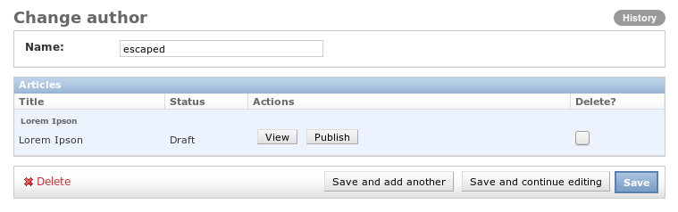

=====================
django-inline-actions
=====================

.. image:: https://travis-ci.org/escaped/django-inline-actions.png?branch=master
    :target: http://travis-ci.org/escaped/django-inline-actions
    :alt: Build Status

.. image:: https://coveralls.io/repos/escaped/django-inline-actions/badge.png?branch=master
    :target: https://coveralls.io/r/escaped/django-inline-actions
    :alt: Coverage

django-inline-actions adds actions to the InlineModelAdmin.

Screenshot
==========

Installation
============

#. Install django-inline-actions ::

    pip install https://github.com/escaped/django-inline-actions.git

#. Add ``inline_actions`` to your ``INSTALLED_APPS``.

Integration
===========

Add the ``InlineActionMixin`` to your ``InlineModelAdmin`` and
the ``InlineActionsModelAdminMixin`` to your ``ModelAdmin``.
Each action is implemented as a method on the ``InlineModelAdmin`` and has the
following signature ::

    def action_name(self, request, obj, inline_obj)

#. ``request`` - current request
#. ``obj`` - instance of the parent model
#. ``inline_obj`` - instance on which the action was triggered

and should return ``None`` to return to the current changeform or a ``HttpResponse``.
Finally, add your method name to the ``actions`` property.
To add your actions dynamically, you can use the method
``get_actions(self, request, obj=None)`` instead.

This module is bundled with two actions for viewing
(``inline_actions.actions.ViewAction``) and deleting
(``inline_actions.actions.DeleteAction``).
Just add these classes to your ``InlineModelAdmin`` and you're done.

Example
=======
Imagine a simple news application with the following ``admin.py``. ::

    from django.contrib import admin
    from inline_actions.admin import InlineActionsMixin
    from inline_actions.admin import InlineActionsModelAdminMixin

    from .models import Article, Author

    class ArticleInline(InlineActionsMixin,
                        admin.TabularInline):
        model = Article
        actions = []

        def has_add_permission(self):
            return False

    @admin.register(Author)
    class AuthorAdmin(InlineActionsModelAdminMixin,
                      admin.ModelAdmin):
        inlines = [ArticleInline]
        list_display = ('name',)

    @admin.register(Article)
    class AuthorAdmin(admin.ModelAdmin):
        list_display = ('title', 'status', 'author')

We now want to add two simple actions (``view``, ``unpublish``) to
each article within the ``AuthorAdmin``.
The ``view`` action redirects to the changeform of the selected instance ::

    from django.core.urlresolvers import reverse
    from django.shortcuts import redirect

    class ArticleInline(InlineActionsMixin,
                        admin.TabularInline):
        # ...
        actions = ['view']
        # ...

        def view(self, request, obj, inline_obj):
            url = reverse(
                'admin:{}_{}_change'.format(
                    inline_obj._meta.app_label,
                    inline_obj._meta.model_name,
                ),
                args=(inline_obj.pk,)
            )
            return redirect(url)
        view.short_description = _("View")

Since ``unpublish`` depends on ``article.status`` we must use ``get_actions`` to
add this action dynamically. ::

    from django.contrib import admin, messages
    from django.utils.translation import ugettext_lazy as _

    class ArticleInline(InlineActionsMixin,
                        admin.TabularInline):
        # ...
        def get_actions(self, request, obj=None):
            actions = super(ArticleInline, self).get_actions(request, obj)
            if obj:
                if obj.status == Article.PUBLISHED:
                    actions.append('unpublish')
            return actions

        def unpublish(self, request, obj, inline_obj):
            inline_obj.status = Article.DRAFT
            inline_obj.save()
            messages.info(request, _("Article unpublished"))
        unpublish.short_description = _("Unpublish")

Example Application
===================
You can see ``django-inline-actions`` in action using the bundled test application
``test_proj`` ::

   git clone https://github.com/escaped/django-inline-actions.git
   cd django-inline-actions/test_proj
   ./manage.py migrate
   ./manage.py createsuperuser
   ./manage.py runserver

Open `<http://localhost:8000/admin/>`_ in your browser and create an
author and some articles.
